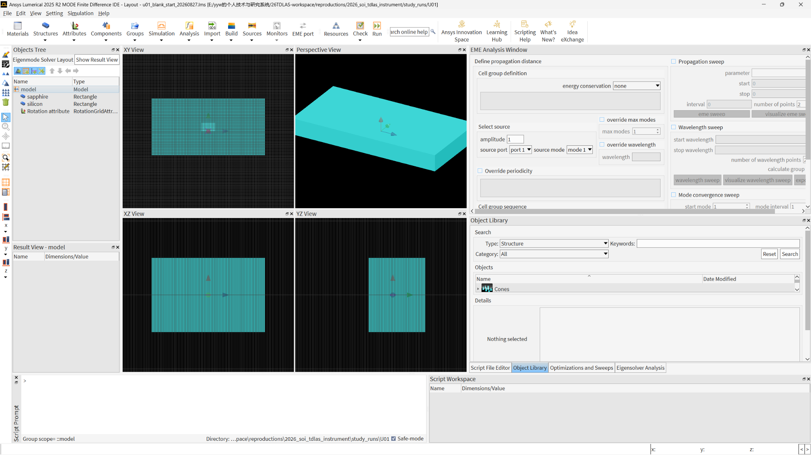
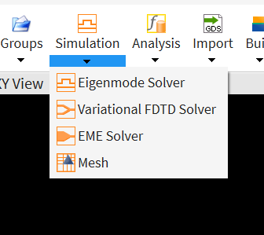
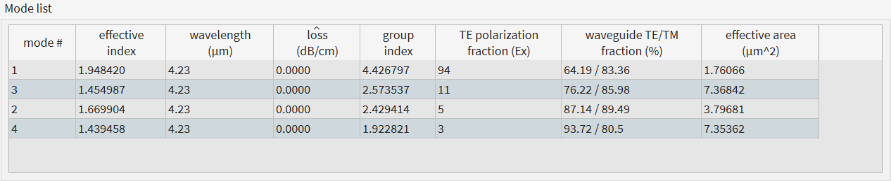
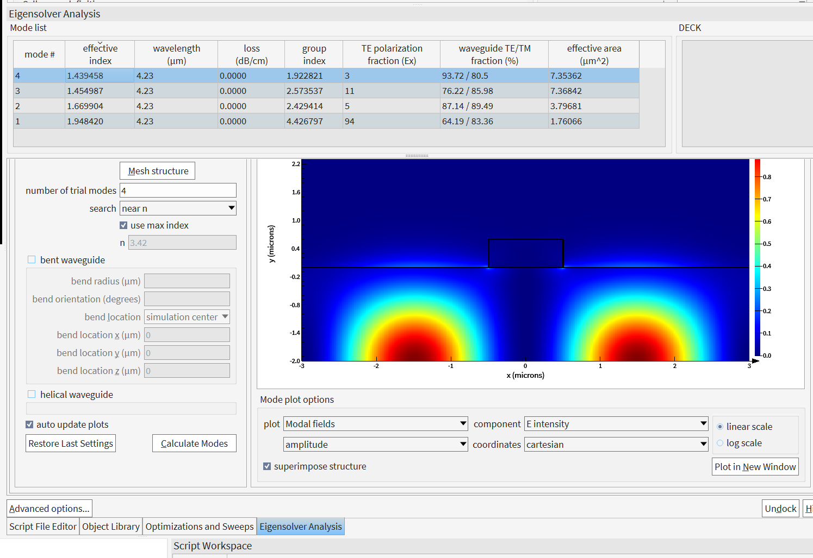
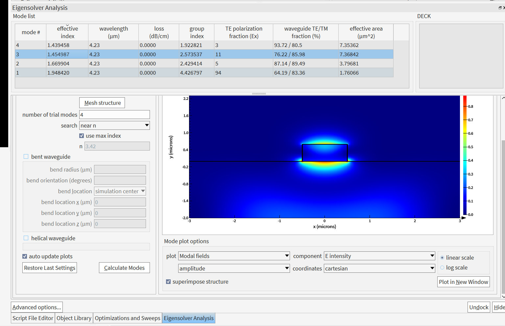
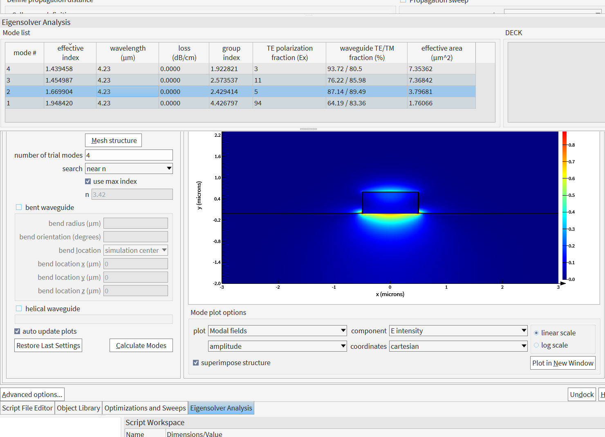
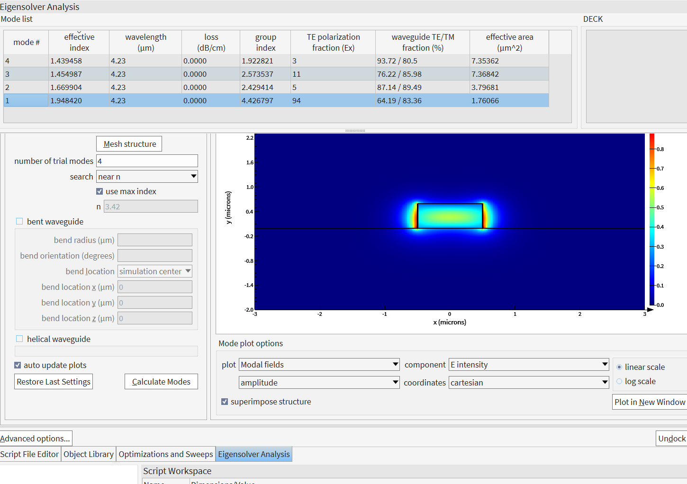

# U01 实操记录：Lumerical MODE / FDE 本征模求解

> 当前阶段：**Ansys Lumerical MODE 2025 R2 — Eigenmode Solver / FDE**
>
> 当前目标：先把 4.23 μm 下 SOS 波导的本征模求解、模式识别和界面操作跑通，再进入参数扫描与 EFR 计算。

本页是 [U01：M0 FDE、本征模与 Poynting EFR](../../lessons/U01_M0_FDE.md)
的配套实操证据，不是另一份平行讲义。U01讲义解释“为什么算”；本页保存“界面如何
设置、实际返回了什么、当前证据能支持什么结论”。

> 证据边界：这里使用对象定义折射率和理想无损横截面。截图能够证明当前FDE设置、
> 候选模表和模场形状，但不能证明真实器件零损耗、整段波导传播、加工容差或实验性能。

---

## 0. 当前工程在做什么

目前使用的是 **Ansys Lumerical MODE**。我们当前重点使用的是：

$$
\boxed{\text{Eigenmode Solver} \equiv \text{FDE (Finite-Difference Eigenmode)}}
$$

FDE 的任务不是沿波导一步一步传播，而是在给定横截面上求解 Maxwell 本征问题：

$$
A(\varepsilon,\omega)\mathbf e_m=\beta_m^2\mathbf e_m
$$

其中：

- $A$：由材料、几何、波长、边界条件决定的 Maxwell 离散算子；
- $\mathbf e_m(x,y)$：第 $m$ 个横截面模式的场分布；
- $\beta_m$：该模式的传播常数；
- $n_{\rm eff,m}=\beta_m/k_0$。

完整场可以写成：

$$
\mathbf E_m(x,y,z)=\mathbf e_m(x,y)e^{i\beta_m z}.
$$

## 0.1 与U01讲义的对应关系

| U01讲义步骤 | 本页证据 | 当前结论 | 状态 |
|---|---|---|---|
| 建立x-y横截面 | [Layout总览](images/01_layout_overview.png) | z为传播方向，FDE只解x-y截面 | 已完成 |
| 添加FDE并设置求解参数 | [Eigenmode Solver入口](images/02_eigenmode_solver_menu.png)、[mode1结果页](images/08_mode1_field.png) | 4.23 µm、4个trial modes、`search=near n` | 已完成 |
| 比较候选本征模 | [Mode list](images/04_mode_list_results.png)及mode1–4场图 | 四个数值解不等于四个目标导模 | 已完成 |
| 识别quasi-TE0 | [mode1场图](images/08_mode1_field.png) | `neff=1.948420`、TE fraction=94%，与U01机器基准对账一致 | 已完成单点识别 |
| 宽度扫描与模式追踪 | 0.9/1.0/1.05/1.1 µm数值与模场 | neff、TE fraction、EFR和单峰场共同支持同一qTE0分支 | 已完成人工连续性追踪 |
| Poynting EFR | strip与slot均完成气体区/全截面`Sz`积分 | strip基准10.2300%；slot基准20.8079% | 已完成 |

---

## 1. 软件界面：Layout 到底是什么



当前软件处于 **Layout** 状态时，主要做：

- 画结构；
- 设材料；
- 放置 FDE；
- 修改波导尺寸；
- 修改求解区域；
- 设置 mesh / boundary condition；
- 设置分析波长。

最重要的几个区域：

| 英文 | 中文 | 当前用途 |
|---|---|---|
| Objects Tree | 对象树 | 看 silicon、sapphire、FDE 等对象 |
| XY View | XY 横截面视图 | 当前最重要，因为波导沿 z 传播 |
| XZ / YZ View | 侧视图 | 检查三维几何 |
| Perspective View | 透视图 | 检查整体结构 |
| Script Prompt / Script File Editor | 脚本区 | 后续自动 sweep |
| Eigensolver Analysis | 本征模分析 | 求 mode、看 $n_{\rm eff}$、场分布 |

当前统一坐标约定：

$$
\boxed{+z=\text{波导传播方向}}
$$

所以 FDE 主要求的是 **$x-y$ 横截面**。

---

## 2. FDE 在哪里



在 Lumerical 2025 R2 里：

$$
\boxed{\text{Simulation} \rightarrow \text{Eigenmode Solver}}
$$

就是添加 FDE。

这里容易混淆：

- **FDE** 是求解方法名称；
- GUI 里显示的是 **Eigenmode Solver**。

---

## 3. Modal analysis 参数区

当前参数可在后面的[mode1结果页](images/08_mode1_field.png)左侧直接看到；仓库中不再
引用不存在的`03_modal_analysis_settings.png`。

当前主要参数：

| 参数 | 中文 | 当前理解 |
|---|---|---|
| wavelength | 波长 | 当前 $4.23\,\mu m$ |
| frequency | 频率 | 与波长等价 |
| number of trial modes | 尝试求解的模式数 | 当前为 4 |
| search | 本征值搜索策略 | 可选 near n / in range |
| use max index | 使用最大折射率作为搜索参考 | 当前高折射率 Si 约 3.42 |
| bent waveguide | 弯曲波导 | 当前直波导不勾 |
| Mesh structure | 生成/查看网格 | 检查离散化 |

---

## 4. `span` 的含义

Lumerical 中：

- `y`：区域中心；
- `y span`：该方向总长度。

例如：

```text
y = 0.5 μm
y span = 5 μm
```

则：

$$
y_{\min}=0.5-\frac{5}{2}=-2~\mu m
$$

$$
y_{\max}=0.5+\frac{5}{2}=3~\mu m
$$

因此：

$$
\boxed{y\in[-2,3]~\mu m}
$$

统一公式：

$$
q_{\min}=q-\frac{q_{\rm span}}2,\qquad
q_{\max}=q+\frac{q_{\rm span}}2.
$$

> `span = 5 μm` 是总宽度 5 μm，不是 $\pm5\,\mu m$。

---

## 5. Calculate Modes 到底在算什么

点击 **Calculate Modes** 后，FDE 对整个当前横截面求本征解。

如果设置：

```text
number of trial modes = 4
```

意思不是：

> “这个波导一定有 4 个真正导模。”

而是：

> “请 eigensolver 尝试返回 4 个本征解。”

因此软件可能返回：

- 真正的 core-guided mode；
- 高阶导模；
- weakly guided mode；
- substrate-like mode；
- radiation-like / numerical-window eigenmode。

所以：

$$
\boxed{\text{Calculate Modes 找到 4 个解}
\neq
\text{波导支持 4 个目标导模}}
$$

---

## 6. 当前求出的 Mode list



当前 4.23 μm 结果：

| mode | $n_{\rm eff}$ | group index | TE polarization fraction | waveguide TE/TM fraction | effective area |
|---|---:|---:|---:|---:|---:|
| 1 | **1.948420** | 4.426797 | **94%** | 64.19 / 83.36 | **1.76066 μm²** |
| 2 | 1.669904 | 2.429414 | 5% | 87.14 / 89.49 | 3.79681 μm² |
| 3 | 1.454987 | 2.573537 | 11% | 76.22 / 85.98 | 7.36842 μm² |
| 4 | 1.439458 | 1.922821 | 3% | 93.72 / 80.5 | 7.35362 μm² |

注意：

$$
\boxed{\text{mode 1 / 2 / 3 / 4 只是本次求解排序}}
$$

它们不是永久的物理名字。

真正物理身份需要结合：

$$
\boxed{
\text{场分布}
+
n_{\rm eff}
+
\text{偏振}
+
\text{节点数}
}
$$

来判断。

### 6.1 这些列怎样对应U01的物理问题

| 列 | 当前数值怎样读 | 在U01中的作用 | 不能推出 |
|---|---|---|---|
| effective index | mode1为1.948420，位于sapphire 1.67与Si 3.42之间 | 传播常数、相位和核心导引的关键证据 | 透射率、输入耦合效率 |
| loss | 四个候选模均显示0.0000 dB/cm | 只描述当前理想模型和显示精度 | 真实器件零损耗 |
| group index | mode1为4.426797 | 群速度、群时延和色散 | 模式一定更正确或Gamma更大 |
| TE polarization fraction (Ex) | mode1约94% | 横截面内`Ex`相对`Ex+Ey`占主导，支持quasi-TE身份 | TE0阶数、传播功率占比 |
| waveguide TE/TM fraction | mode1为64.19 / 83.36 | 分别检查完整E/H场中横向场所占比例，包含纵向`Ez/Hz`的影响 | 与前一列使用同一定义 |
| effective area | mode1为1.76066 µm² | 场集中程度的辅助证据 | silicon面积、气体Gamma或Poynting EFR |

对z向传播，前后两套TE指标回答的问题不同：

```text
TE polarization fraction (Ex)
= integral(|Ex|^2) / integral(|Ex|^2 + |Ey|^2)

waveguide TE fraction
= 1 - integral(|Ez|^2) / integral(|E|^2)
```

因此`94%`与`64.19%`可以同时成立：前者说横向电场中`Ex`占主导，后者还考虑
纵向电场`Ez`。两者都不是“94%的传播功率位于波导中”。传播功率必须回到U01的
纵向Poynting分量`Sz`积分。

---

## 7. 当前最大疑问：为什么 4 个模式很多都不围绕中心 Si 波导？

### 7.1 Mode 4



观察：

- 场主要进入 sapphire 深处；
- 中央 Si 波导附近并不是主要能量区；
- $n_{\rm eff}=1.439458$。

初步判断：

$$
\boxed{\text{不是目标 Si core guided mode}}
$$

当前截图呈现明显的substrate/window-like特征：

- substrate-like；
- radiation-like；
- 有限计算窗口产生的其他本征解。

这里只能确定它不是本次目标quasi-TE0；若要在上述三类之间严格定性，还需要边界、
窗口和网格收敛检查。

---

### 7.2 Mode 3



观察：

- 场主要分布在 Si / substrate 界面及其周围；
- 横向并没有明显被中心 Si core 束缚；
- $n_{\rm eff}=1.454987$；
- TE fraction 仅 11%。

初步判断：

$$
\boxed{\text{不是目标 qTE}_0}
$$

更像 substrate/interface-like 解。这里的“更像”是场形诊断，不是完整泄漏证明。

---

### 7.3 Mode 2



观察：

- 有一定界面附近集中；
- 但并没有像真正 qTE core mode 那样明显集中在 Si core；
- $n_{\rm eff}=1.669904$；
- TE fraction 仅 5%。

初步判断：

$$
\boxed{\text{不是本次目标 quasi-TE}_0}
$$

它的`neff`几乎贴近sapphire折射率1.67，且TE polarization fraction仅5%；结合场主要
分布在Si/sapphire界面下方，可作为TM/substrate-like候选，但本页不进一步断言其
严格物理类别。

---

### 7.4 Mode 1



Mode 1 的特征：

$$
n_{\rm eff}=1.948420
$$

$$
\text{TE polarization fraction}=94\%
$$

且场明显集中在中央 Si 矩形及其周围。

因此当前最合理的判断是：

$$
\boxed{\text{当前单点的 mode 1 与 U01 基准 quasi-TE}_0\text{ 一致}}
$$

确认依据不是“它叫mode1”，而是`neff=1.948420`与机器基准一致、TE polarization
fraction约94%，并且模场局域在Si核心。当前显示的`E intensity`会丢失符号，因此它
不能单独检查节点；切换到`Ex`仍是有价值的独立场形复核。

---

## 8. 为什么 FDE 会给出这些“奇怪模式”

FDE 实际求的是整个计算窗口：

$$
\text{silicon}
+
\text{sapphire}
+
\text{air}
+
\text{boundary condition}
+
\text{finite simulation window}
$$

对应的 Maxwell 本征问题。

软件不知道我们心里想的是：

> “只给我中间 Si 波导的模式。”

它只知道：

> “请给我这个横截面中满足 Maxwell 方程和边界条件的本征解。”

因此：

$$
\boxed{
\text{FDE eigenmode}
\neq
\text{一定是我们感兴趣的 waveguide guided mode}
}
$$

必须由我们做物理筛选。

---

## 9. 怎么判断真正的 guided mode

以后固定看四件事。

### 9.1 场是不是围绕 core

真正的 guided mode 应该主要围绕中央波导束缚。

---

### 9.2 有效折射率 $n_{\rm eff}$

对于普通无损、真正被 core 束缚的模式，通常希望满足：

$$
\max(n_{\rm clad},n_{\rm substrate})
<
n_{\rm eff}
<
n_{\rm core}
$$

这不是绝对万能判据，但非常有用。

如果一个模式：

$$
n_{\rm eff}
$$

已经非常接近 substrate / cladding 折射率，同时场又铺在 substrate 中，就要高度警惕它是 substrate-like 模式。

---

### 9.3 偏振

当前软件给出：

```text
TE polarization fraction (Ex)
```

例如：

- mode 1：94% → 很 TE-like；
- mode 2：5%；
- mode 3：11%；
- mode 4：3%。

所以 mode 1 明显最符合 qTE 候选。

但是：

$$
\boxed{\text{TE fraction 高}\neq\text{自动等于 TE}_0}
$$

它只能判断“偏振家族”，不能判断阶数。

---

### 9.4 节点数

基模应该没有额外横向节点。

当前显示的是：

```text
component = E intensity
```

即：

$$
|E|^2
$$

强度没有正负号，因此无法可靠判断场的符号变化和节点。

下一步应该看：

$$
E_x
$$

或者其他主导场分量的 real part / amplitude。

对当前 qTE 候选，优先看：

$$
\boxed{E_x(x,y)}
$$

---

## 10. qTE / qTM 目前应怎么理解

真实矩形高折射率波导一般不是理想二维 TE/TM，而是 hybrid vector mode。

因此通常说：

$$
\boxed{\text{quasi-TE}}
$$

和：

$$
\boxed{\text{quasi-TM}}
$$

qTE 的意思不是“只有 $E_x$”。

而是：

> 某个横向电场分量占主导，模式整体表现得更 TE-like。

所以：

$$
E_x,E_y,E_z
$$

都可能不为 0。

---

## 11. 论文 benchmark：2014 SOS 波导

当前复现参考的是 2014 Huang 等的 SOS 中红外倏逝场气体传感波导。

论文在：

$$
\lambda=4.23~\mu m
$$

研究 strip / rib / slot 波导，并讨论 qTE、qTM 模式与 EFR。

其中 strip qTE 示例参数之一：

$$
W=1~\mu m,\qquad H=0.6~\mu m
$$

论文展示的 qTE 模场主要围绕 Si 波导分布，同时在侧壁气体区有明显场增强。

因此当前仿真应该逐步对齐：

1. 几何尺寸；
2. Si / sapphire 折射率；
3. cladding 介质；
4. FDE 计算窗口；
5. boundary condition；
6. mesh；
7. mode identification。

---

## 12. Evanescent Field Ratio（EFR）

2014 论文定义：

$$
\eta=
\frac{
\iint_{\rm Gas}\mathbf S\cdot\mathbf n\,dA
}{
\iint_{\rm All}\mathbf S\cdot\mathbf n\,dA
}
$$

其中：

- $\mathbf S$：Poynting vector；
- 分子：气体区域中的传播功率；
- 分母：整个模式总传播功率。

所以：

$$
\boxed{\mathrm{EFR}=\text{模式传播功率中位于气体区域的比例}}
$$

不是简单的：

$$
\frac{\int_{\rm gas}|E|^2}{\int_{\rm all}|E|^2}
$$

也不是实际输入光中某个 mode 的激发系数。

---

## 12.1 已有基准代码怎样从本征模算出 EFR

已有M0基准实现分为两层，不应把它们混成一种语言：

```text
Python驱动程序
  -> 通过lumapi启动MODE
  -> 把Lumerical Script交给MODE执行
  -> MODE建立横截面并求本征模
  -> Python读取mode1的E和Poynting数据
  -> 建立气体区域掩膜
  -> 对Pz做二维积分
  -> 输出EFR、JSON、CSV和模场图
```

- 外层`.py`负责自动化、数组处理、积分和文件输出；
- 内层Lumerical Script负责建立结构、设置FDE并调用`findmodes`；
- MODE中的Script File Editor主要用于查看和运行`.lsf`脚本；已有基准的主体文件则是
  Python，内部动态生成一段Lumerical Script。

### 12.1.1 内层：建立截面并求模式

以下是已有实现的核心结构。`set`只是在设置几何或求解器参数，真正触发本征模计算的
是最后的`findmodes`：

```lsf
addrect;
set("name", "sapphire");
set("y", -2e-6);
set("y span", 4e-6);
set("index", 1.67);

addrect;
set("name", "silicon");
set("x span", 1.0e-6);
set("y", 0.3e-6);
set("y span", 0.6e-6);
set("index", 3.42);

addfde;
set("solver type", 3);
set("x span", 6e-6);
set("y", 0.5e-6);
set("y span", 5e-6);
set("mesh cells x", 300);
set("mesh cells y", 300);
setanalysis("wavelength", 4.23e-6);
setanalysis("number of trial modes", 4);

mode_count = findmodes;
```

这里的`solver type = 3`对应当前使用的`2D Z normal`，即沿z传播、在x-y截面求解。

### 12.1.2 外层：从MODE取回场数据

Python通过`lumapi`让MODE执行上面的脚本，然后读取目标模式的数据：

```python
with lumapi.MODE(hide=hide) as mode:
    mode.eval(build_script(width_m, height_m, wavelength_m))
    poynting = mode.getresult("FDE::data::mode1", "P")
    electric = mode.getresult("FDE::data::mode1", "E")
```

这里使用`mode1`，是因为参考截面已经通过`neff + TE fraction + 核心局域场形`确认它
对应目标quasi-TE0；这不是“任何宽度都固定选择mode1”的理由。

### 12.1.3 为什么数组最后取索引2

MODE返回的`P`包含三个空间分量。波导沿z传播，所以代码取第三个分量并保留其实部：

```python
x = np.asarray(poynting["x"]).reshape(-1)
y = np.asarray(poynting["y"]).reshape(-1)
pz = np.real(np.asarray(poynting["P"])[:, :, 0, 0, 2])
```

其中最后的`2`表示Python从0开始计数的第三个分量，即`Pz`。它对应时间平均纵向功率
密度：

$$
S_z=\frac{1}{2}\,\mathrm{Re}\left(E_xH_y^*-E_yH_x^*\right).
$$

### 12.1.4 怎样把“气体区域”翻译成布尔掩膜

当前silicon核心占据：

$$
-0.5\le x\le0.5~\mu m,\qquad 0\le y\le0.6~\mu m.
$$

代码先标记核心，再把“sapphire上表面以上且不属于核心”的网格标为气体：

```python
xx, yy = np.meshgrid(x, y, indexing="ij")

in_core = (
    (np.abs(xx) <= width_m / 2)
    & (yy >= 0.0)
    & (yy <= height_m)
)

in_gas = (yy >= 0.0) & ~in_core
```

因此气体掩膜包含波导上方和左右侧壁外的区域，不包含silicon，也不包含`y < 0`的
sapphire。若以后加入保护层、开窗或其他材料，这个掩膜必须跟着真实材料区域修改。

### 12.1.5 二维积分与最终比值

已有实现使用两次梯形积分：先沿y积分，再沿x积分。

```python
def integrate_xy(values, x, y):
    return float(
        np.trapezoid(
            np.trapezoid(values, y, axis=1),
            x,
            axis=0,
        )
    )

total_power = integrate_xy(pz, x, y)
gas_power = integrate_xy(np.where(in_gas, pz, 0.0), x, y)
efr = gas_power / total_power
```

`np.where(in_gas, pz, 0.0)`的含义是：气体网格保留`Pz`，其他网格置零，然后再对整个
数组积分。

已有机器基准为：

$$
P_{\mathrm{total}}=1.9868004353\times10^{-15},
$$

$$
P_{\mathrm{gas}}=2.0325067012\times10^{-16}.
$$

所以：

$$
\mathrm{EFR}
=\frac{P_{\mathrm{gas}}}{P_{\mathrm{total}}}
=0.1023005\approx10.23\%.
$$

本征模的绝对幅值可以采用任意归一化，因此这两个功率写成任意单位；场整体缩放时，
分子和分母会同时乘以相同因子，EFR比值不变。该`0.1023005`是已有机器基准，不是
当前GUI学习模型尚未完成的个人EFR验证。

### 12.1.6 阅读这段代码时固定问六件事

1. 输入的几何、材料和波长是什么？
2. 哪一行真正运行求解器？
3. 当前读取的是哪个模式，模式身份依据是什么？
4. 取的是`Pz`、`|E|^2`还是其他物理量？
5. 气体掩膜是否与真实材料区域一致？
6. 分子、分母和积分单位是否使用同一套网格与定义？

---

## 13. Evanescent field 和 leakage 不是一回事

这是后面做气体传感必须一直保留的区别。

正常 guided mode 外部场可以：

$$
E\sim e^{-\kappa r_\perp}
$$

存在明显 evanescent tail。

但：

$$
\boxed{\text{Evanescent field 大}\neq\text{光正在大量漏掉}}
$$

我们真正想要的是：

$$
\boxed{\text{大的、但仍然是 evanescent 的气体区场}}
$$

而不是：

$$
\boxed{\text{radiation / substrate leakage}}
$$

---

## 14. 当前已经解决的问题

- [x] Layout / Analysis 基本含义
- [x] FDE = Eigenmode Solver
- [x] FDE 位于 Simulation → Eigenmode Solver
- [x] `span` 的几何含义
- [x] Modal analysis 界面主要参数
- [x] Calculate Modes 的作用
- [x] `number of trial modes = 4` 的正确含义
- [x] Mode list 各列含义
- [x] `mode 1–4` 只是临时编号
- [x] 为什么会出现不围绕中心波导的本征解
- [x] 识别 mode 1 是当前单点的qTE基模候选
- [x] 明确 `E intensity` 不足以最终判断基模阶数
- [x] 用`neff + TE fraction + 核心局域模场`与U01机器基准对账，确认当前单点mode1
      对应目标quasi-TE0
- [x] 完成0.9/1.0/1.05/1.1 µm strip宽度点的人工模式连续性追踪
- [x] 亲手用`Re(Pz)`积分复现strip基准EFR约10.23%
- [x] 建立W=2.0 µm、S=0.3 µm的SOS slot单点并复现EFR约20.81%
- [x] 将slot气体功率分成中央槽9.8777%与槽外气体10.9302%，分区求和闭合
- [x] 理解FDE在整个横截面求解，neff不是silicon内部的局部折射率

---

## 15. 后续扩展

### P1. 用定量模场重叠扩展人工模式追踪

目前已用neff、偏振、EFR趋势和Ex单峰模场完成相邻宽度的人工连续性追踪。若参数范围
扩大或接近模式交叉，应进一步计算相邻点模场重叠。

---

### P2. 对非目标解做边界与收敛审计

当前已核验：sapphire折射率1.67、Si折射率3.42、FDE窗口`x=-3...3 µm`、
`y=-2...3 µm`、网格`300×300`、`search=near n`。求解器返回substrate/window-like
候选解本身不表示模型设置错误，因为trial modes要求的是多个本征解，而不是多个目标
核心导模。

若需要严格区分substrate-like、radiation-like和有限窗口数值解，还应继续检查：

1. 外边界条件及PML选择；
2. substrate深度和x/y窗口扩大后的结果是否收敛；
3. 网格加密后`neff`和场形是否稳定；
4. 非目标模是否持续贴近边界或基底；
5. 材料色散模型与当前对象定义常数折射率的差异。

---

### P3. 做二维slot扫描

将slot响应视为`EFR=f(W,S)`。先固定W=2.0 µm扫描S=0.2/0.3/0.4 µm，再按论文
口径固定各个S扫描W；每一点重新生成硅轨与掩膜并追踪目标模式。

---

### P4. 完成2014 SOS rib/slab结构学习

strip与slot已有个人实操证据；下一步按论文证据建立rib/slab截面，继续区分论文参数、
合理假设和未验证分支。

---

### P5. FDE窗口与网格收敛

保持几何、波长、模式分支和近似网格步长不变，分别扩大FDE窗口与加密网格，比较
neff、模场和EFR是否稳定，避免把窗口截断误差当作结构效应。

---

## 16. 重要的 5 句话

1.  
$$
\boxed{\text{FDE 求的是整个横截面的 Maxwell 本征解}}
$$

2.  
$$
\boxed{\text{trial modes = 4 不代表波导有 4 个真正导模}}
$$

3.  
$$
\boxed{\text{mode 1–4 是数值排序，不是永久物理身份}}
$$

4.  
$$
\boxed{\text{真正的模式识别要看场分布 + }n_{\rm eff}\text{ + 偏振 + 节点}}
$$

5. 当前单点mode1已通过`neff + TE fraction + 核心局域模场`与U01机器基准对账；
   `Ex`图用于进一步检查节点，而不是因为mode1编号本身可信。

---

## 17. 当前工作流

```text
搭结构
↓
设置材料
↓
放 FDE
↓
设置 λ = 4.23 μm
↓
设置横截面 / span / boundary / mesh
↓
Calculate Modes
↓
获得 mode 1 ... mode 4
↓
看 neff + polarization + field
↓
确认 qTE0 / qTM0
↓
mode tracking
↓
宽度/高度 sweep
↓
计算 EFR
↓
对齐 Huang 2014
```

---
